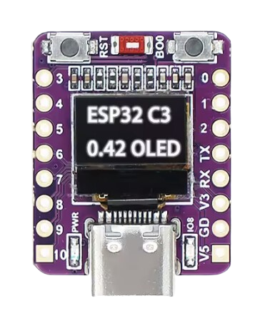

# MIROS v1.0 — ESP32-C3 0.42" OLED Smart Firmware

A feature-packed micro operating system for ultra-compact ESP32-C3 boards with an integrated 72×40 SSD1306 OLED. Sixteen built-in apps, all driven by a single button gesture engine.

Built with PlatformIO and the Arduino framework.

**🔗 Live interactive demo / full docs: [mirosesp.netlify.app](https://mirosesp.netlify.app/)**
Try the gestures and every app in a browser-based hardware simulator before flashing real hardware.



---

## Board

Targets the **ESP32-C3 0.42" OLED** dev board (pictured above): ESP32-C3 RISC-V @ 160MHz, built-in 72×40 SSD1306 I2C OLED, USB-C, RST/BOOT buttons, and broken-out GPIOs (0–10) plus power pins (V3, V5, GD).

- **MCU:** ESP32-C3 RISC-V @ 160MHz
- **Display:** 0.42" OLED (72×40 SSD1306, I2C)
- **Input:** Single button (BOOT)
- **Indicator:** Status LED (GPIO 8)
- **Storage:** Preferences (NVS flash)

---

## Applications (16 built-in apps)

| App | Category | Description | Controls |
|---|---|---|---|
| ⏱️ Stopwatch | Time | Millisecond-precision stopwatch, LED pulses while running | Tap: Start/Pause · Double tap: Reset · Hold 0.7s: Exit |
| ⏳ Countdown Timer | Time | Presets from 1–60 min, hold-to-start progress bar, alarm flashes screen + LED | Tap: Cycle presets/Pause · Hold 3s: Start · Double tap: Reset |
| 🍅 Pomodoro | Time | 25 min work / 5 min break cycles, tracks completed sessions | Tap: Start work/break · Hold 0.7s: Cancel |
| 🎲 Dice Roller | Chance | Animated D6 roll, fair 1–6 outcome | Tap: Roll · Hold 0.7s: Exit |
| 🎱 Magic 8-Ball | Chance | 14 possible answers, animated shake + scrolling text | Tap: Ask · Hold 0.7s: Exit |
| 🪙 Coin Flipper | Chance | Animated 3D spin, lands on heads/tails | Tap: Flip · Hold 0.7s: Exit |
| 🫁 Breathing Coach | Utility | Box breathing (4s in / 4s hold / 4s out / 4s hold) with animated circle | Tap: Start/Pause · Hold 0.7s: Exit |
| 🔢 Tally Counter | Utility | Persists count to NVS flash, survives power loss | Tap: +1 · Double tap: Reset · Hold 0.7s: Exit |
| 🔦 Flashlight & SOS | Utility | Solid / 50ms strobe / Morse SOS via OLED + onboard LED | Tap: Cycle modes · Hold 0.7s: Exit |
| 📲 QR Code Display | Utility | On-screen scannable QR code (edit target URL in `drawInstructions()`) | Hold 0.7s: Exit |
| 🐍 Snake | Game | 18×8 grid, persistent high score | Tap: Turn clockwise · Hold 0.7s: Exit |
| 🐦 Flappy Bird | Game | Gravity physics, random pipe gaps, persistent high score | Tap: Flap · Hold 0.7s: Exit |
| 🏓 Pong | Game | Solo paddle, accelerates 3% per bounce, persistent high score | Tap: Reverse paddle · Hold 0.7s: Exit |
| 🚀 Space Defender | Game | Scrolling starfield, laser combat, alien waves, persistent high score | Tap: Fire · Hold 0.7s: Exit |
| 🦖 Dino Runner | Game | Chrome-style runner with jump/duck, persistent high score | Tap: Jump · Hold: Duck · Hold 2s: Exit |
| ℹ️ About | System | Version + author credit with scrolling marquee | Hold 0.7s: Exit |

---

## Controls Reference

| Gesture | Timing | Default Action |
|---|---|---|
| Short tap | < 300 ms | Next menu item / in-app primary action |
| Double tap | < 350 ms window | Reset (Stopwatch, Timer, Tally Counter) |
| Global hold | 700 ms | Enter app / exit to menu |
| Timer hold | 3000 ms | Start countdown timer |
| Dino duck / exit | Hold > 250ms duck, > 2000ms exit | Duck under obstacles / exit to menu |

Exact thresholds are defined at the top of `src/main.cpp` (`HOLD_TIME`, `TIMER_START_HOLD`, `DINO_JUMP_MAX_PRESS`, etc.) if you want to tune the feel.

---

## Power Management

- **Auto-dim:** after 30s of inactivity, display contrast drops from 255 to 30
- **Screensaver:** after 45s total idle (30s dim + 15s delay), a low-brightness bouncing "MIROS" emblem takes over the screen; any button press wakes it
- **NVS persistence:** all game high scores (`snk_hi`, `flp_hi`, `png_hi`, `spc_hi`, `dno_hi`) and the tally counter (`tally_cnt`) survive power loss/reset via ESP32 Preferences

---

## Pin Configuration

| Signal | GPIO |
|--------|------|
| SDA    | 5    |
| SCL    | 6    |
| Button | 9    |
| LED    | 8    |

---

## Software Stack

- [PlatformIO](https://platformio.org/)
- Arduino framework for ESP32
- [U8g2](https://github.com/olikraus/u8g2) — OLED graphics
- Adafruit NeoPixel — LED control
- QRCode — on-screen QR generation
- ESP32 Preferences (NVS) — persisted settings

---

## Setup

1. Install [VS Code](https://code.visualstudio.com/) and the [PlatformIO IDE extension](https://platformio.org/install/ide?install=vscode).
2. Clone this repo:
   ```bash
   git clone https://github.com/DevAvalanche/MIROS.git
   cd MIROS
   ```
3. Open the folder in VS Code. PlatformIO detects `platformio.ini` and installs the correct toolchain and libraries automatically on first load.
4. Connect your ESP32-C3 board over USB-C.
5. Build and upload:
   ```bash
   pio run --target upload
   ```
   or use the PlatformIO toolbar buttons (checkmark to build, arrow to upload).

No WiFi credentials, API keys, or external accounts are required — MIROS runs fully standalone.

---

## License

MIT — see [LICENSE](LICENSE).

---

Developed by **Dev Avalanche**
